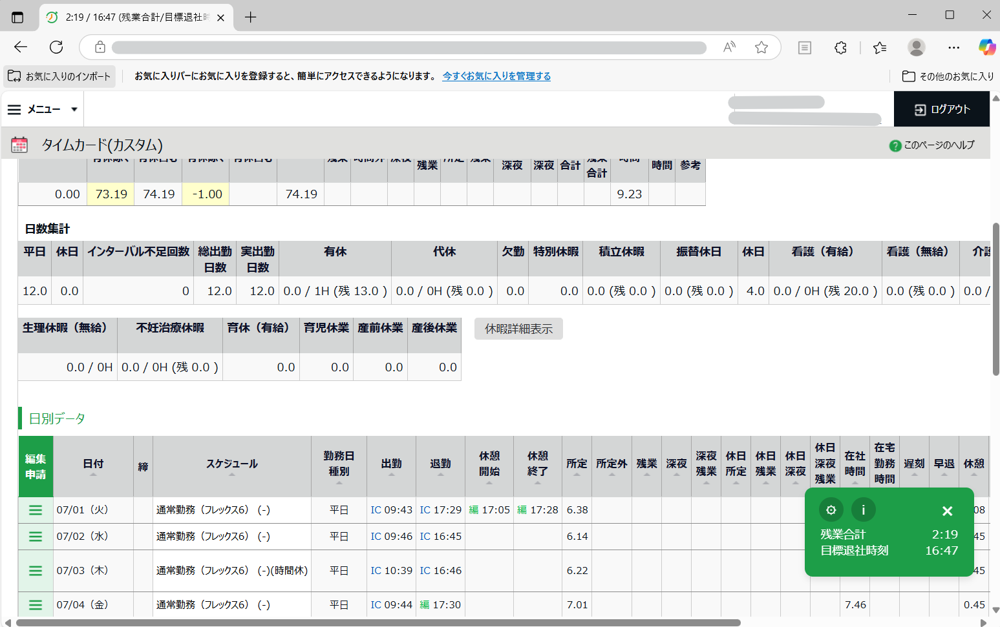
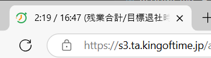
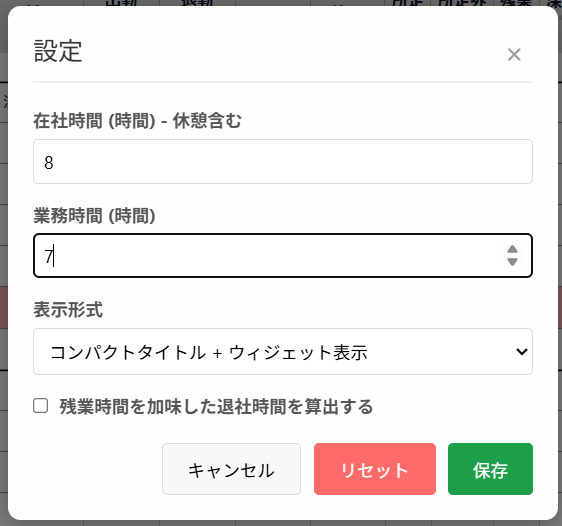

# KOT拡張スクリプト [月の残業時間を計算する]

## これは何？

株式会社ヒューマンテクノロジー社が提供する勤怠管理システムKING OF TIME(キングオブタイム)と組み合わせて使用する、非公式なユーザースクリプトです。

## 何ができるの？

今月の残業時間を計算して画面上に表示します。  
また、出勤を打刻していれば、今日の分の残業時間をゼロにするための目標帰宅時間も表示されます。

## 何が便利なの？

KING OF TIMEにはもとから残業時間を表示する機能がありますが、ここで表示されるのはその月の残業した時間をただ足しただけの時間です。残業をせずに早く帰った日があったとしてもその分だけ引いてくれるようにはなっていません。
このユーザースクリプトでは、実際の労働時間の合計と適正な労働時間の合計を計算し、その差を表示します。

## インストール方法と使い方

### インストール方法 

本スクリプトはEdgeブラウザの拡張機能として実装されているので、Edgeブラウザに拡張機能をインストールします。

* Releaseページから"KoT-Ext_CalcOvertime.zip"をダウンロードし、任意のフォルダに展開する。
* EdgeブラウザでURL入力欄に"edge://extensions/"を入力し、「拡張機能」のページを開く。
* 「開発者モード」を有効にする。
* 「展開して読み込み」をクリックする。ディレクトリの選択画面が表示される。
* 事前に"KoT-Ext_CalcOvertime.zip"を展開したフォルダを選択する。
* インストールが成功する。
* ！！！注意！！！：「開発者モード」を無効にしてください。

### アップデート方法

* 「拡張機能」のページから再度、「展開して読み込み」を実行することでアップデートされます。

### 使い方

* KING OF TIMEにログインし、タイムカードを表示すると自動的にタブタイトルとウィジェットに残業時間が表示されます。  

  * 1 タブタイトル  
      
  * 2 ウィジェット  
      

### 時短勤務の場合

ウィジェットから設定画面を開き、設定を変更してください。

### 半休を取得した場合  

半休を取得した場合でも、正常に計算できるようになっています。  
しかしその他の全てのスケジュール種別で正常に計算できることを確認したわけではありません。  
もし正常に計算ができない場合を発見した場合は、Issueを立ててくれるとありがたいです。  
できれば修正に協力してくれるともっとありがたいです。

